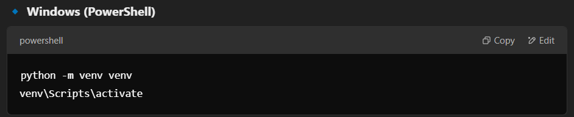
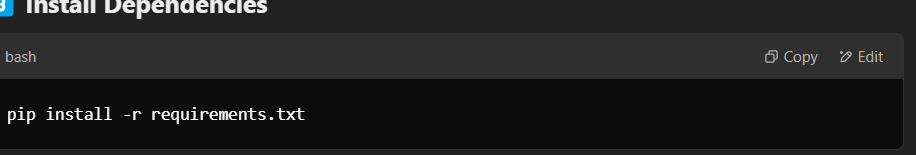
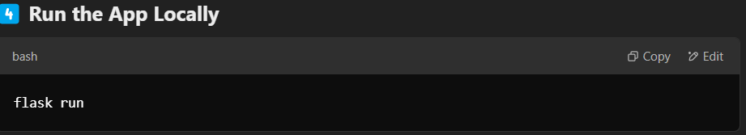
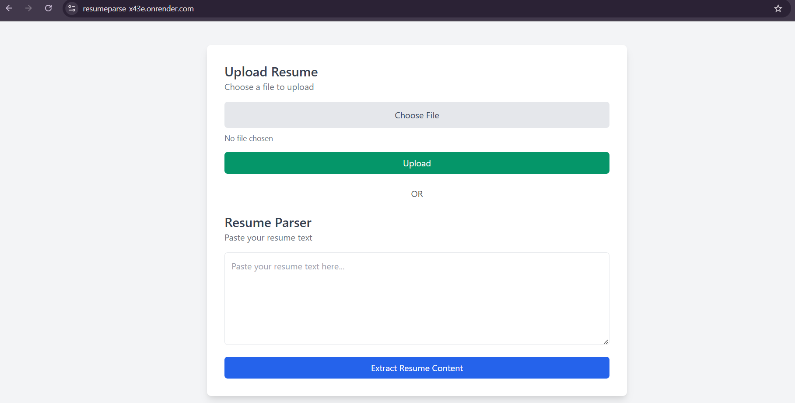
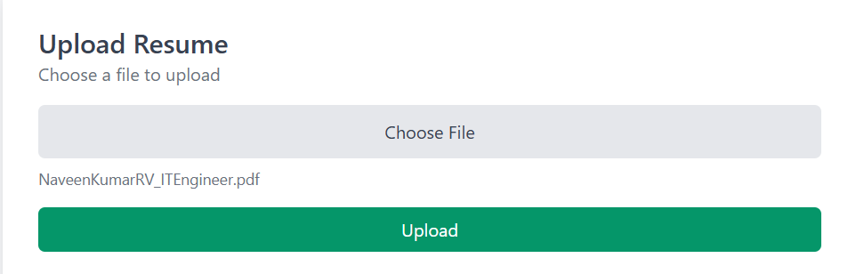
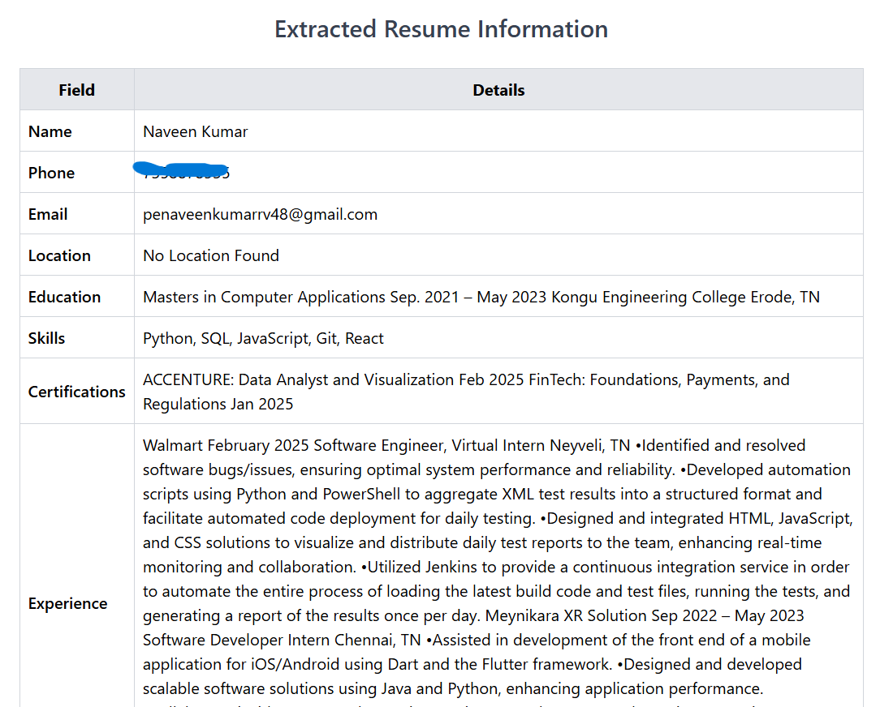
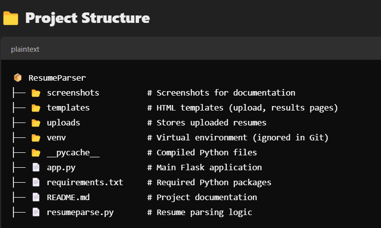

# 📄 Resume Parser - Extract Resume Details Instantly! 🚀  

### **🔗 Live Demo:** [Resume Parser](https://resumeparse-x43e.onrender.com)  
_Extract Name, Phone, Email, Location, Education, Skills, Experience & More!_

---

## 🛠 **Features**  
✅ Upload PDF, DOCX, or Paste Resume Text  
✅ Extracts structured data instantly  
✅ Beautiful UI with Tailwind CSS  
✅ Flask-powered backend with Gunicorn  
✅ **Live on Render** (Free Hosting)  

---

## 🖥 **Screenshots**  

### 📌 1️⃣ **Upload Page**  
  

### 📌 2️⃣ **Resume Parsing in Action**  
  

### 📌 3️⃣ **Mobile-Friendly UI**  
  

### 📌 4️⃣ Upload Page  
  

### 📌 5️⃣ Resume Parsing in Action  
  

### 📌 6️⃣ Mobile-Friendly UI  
  

### 📌 7️⃣ Final Extracted Resume Data  
  

---
## 📦 **Releases & Packages**  

### 📌 Latest Release: [v1.0 - Initial Release](https://github.com/Naveensmart48/Resumeparse/releases)  
✅ Supports PDF, DOCX, and TXT file parsing  
✅ Extracts Name, Email, Phone, Location, Skills, and Experience  

### 📦 GitHub Package (Coming Soon)  
📌 Future plan: Allow users to install Resume Parser via `pip install resumeparse`  

## 🚀 **Installation Guide (Run Locally)**  

### **1️⃣ Clone the Repo**  
```bash
git clone https://github.com/Naveensmart48/Resumeparse.git
cd Resumeparse
